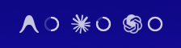
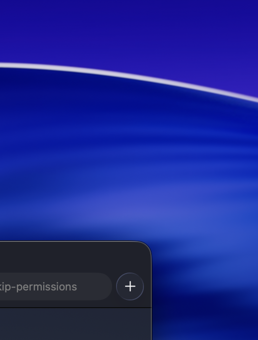

# ⏳ Usage Status

A lightweight, native macOS menu bar application to track your rolling 5-hour and weekly usage limits for **Google Antigravity**, **Anthropic Claude Code**, and **OpenAI Codex** in real-time.

---

## 📸 Screenshots

### Menu Bar Status


### Live Dashboard


---

## ✨ Features

- **🔋 Provider-reported usage:** Reads percentage and reset information directly from supported local provider session data.
- **🎨 Native Integration:** Clean, monochrome SwiftUI design that seamlessly blends with your macOS menu bar (supports dark & light modes).
- **📈 Legibility-First UI:** Enlarged legibility typography with thin, non-intrusive progress bars and circular menu bar gauges.
- **⏳ Smart Rollover Prediction:** Displays precise, rolling-window countdowns (e.g., `(14m)` or `(2d)`) showing exactly when your limit will refresh.
- **⚡ Honest availability:** Missing or unsupported local data is shown as unavailable instead of being reported as zero usage.

---

## 🛠️ Installation & Build

### 1. Download
You can download the pre-packaged `.dmg` from the [Releases](https://github.com/devqcf/usage-status/releases) tab.

### 2. Manual Build
If you prefer to build the app from source:

```bash
# Clone the repository
git clone https://github.com/devqcf/usage-status.git
cd usage-status

# Build the Release version
xcodebuild -project "Usage Status.xcodeproj" -scheme "Usage Status" -configuration Release build SYMROOT=build
```

The compiled application bundle will be generated under `build/Release/Usage Status.app`.

---

## 📂 Project Architecture

- **Usage_StatusApp.swift**: Owns the menu bar scene and its compact gauges.
- **ContentView.swift**: Displays provider-reported percentages, reset times, and data availability.
- **UsageManager.swift**: Loads provider snapshots off the main thread and monitors local data directories for changes.
